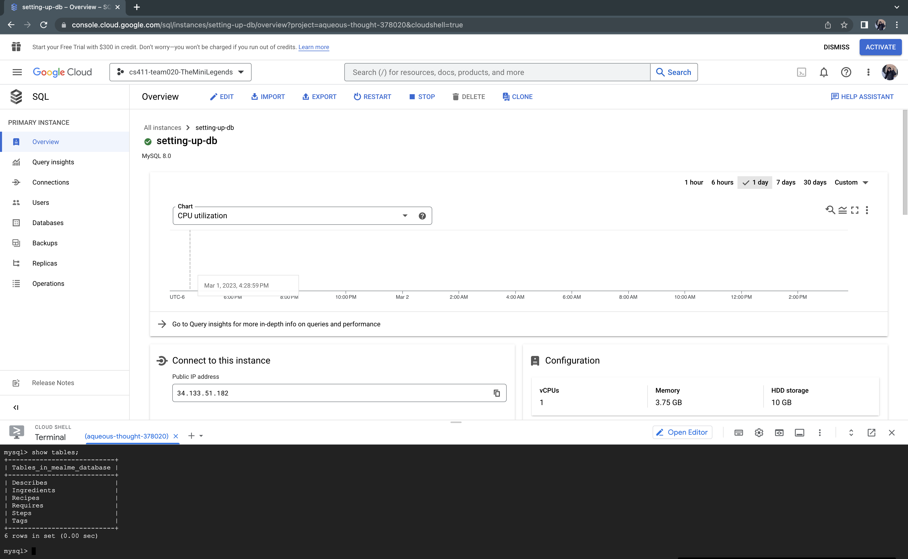

# GCP Implementation 
> Proof of our GCP setup 



# DDL Commands and Proof of Number of Rows
> DDL commands we used to create our tables accompanied by a simple query to get the number of rows for each table


### Recipes Table: 
```
CREATE TABLE Recipes(
	RecipeId INT,
	RecipeName VARCHAR(100),
	Time INT,
	NumberOfSteps INT,
	PRIMARY KEY (RecipeId)
);
```


### Steps Table: 
```
CREATE TABLE Steps(
    StepId INT,
    Instruction VARCHAR(255),
    OrderNumber INT,
    Instruct INT,
    PRIMARY KEY (StepId),
    FOREIGN KEY (Instruct) REFERENCES Recipes(RecipeId)
);
```


### Tags Table: 
```
CREATE TABLE Tags(
	TagId INT,
	TagDescription VARCHAR(500),
	PRIMARY KEY (TagId)
);
```


### Ingredients Table: 
```
CREATE TABLE Ingredients(
	IngredientName VARCHAR(50),
	Image VARBINARY(256),
	PRIMARY KEY (IngredientName)
);
```


### Describes Table:
```
CREATE TABLE Describes(
	TagId INT,
	RecipeId INT,
	PRIMARY KEY (TagId, RecipeId),
	FOREIGN KEY (TagId) REFERENCES Tags(TagId),
	FOREIGN KEY (RecipeId) REFERENCES Recipes(RecipeId)
);
```


### Requires Table:
```
CREATE TABLE Requires(
	RecipeId INT,
	IngredientName VARCHAR(50),
	PRIMARY KEY (RecipeId, IngredientName),
	FOREIGN KEY (RecipeId) REFERENCES Recipes(RecipeId),
	FOREIGN KEY (IngredientName) REFERENCES Ingredients(IngredientName)
);
```


# Advanced Queries
> Two SQL queries that involve at least two of the following SQL concepts: join of multiple relations, jet operations, aggregation via GROUP BY, subqueries

## Query 1: 
### Description: 
Display the recipe name, the time it takes to cook, and the number of steps involved, and all the steps in order for each recipe

```
SELECT RecipeName, Time, NumberOfSteps, GROUP_CONCAT(Instruction 
                                                    ORDER BY OrderNumber ASC 
                                                    SEPARATOR '\n ' ) AS Instructions
FROM Recipes r JOIN Steps s ON (r.RecipeId = s.Instruct)
GROUP BY r.RecipeId
```
### Execution: 
SHOW FIRST 15 ROWS OF QUERY


## Query 2: 
### Description: 
Gather easy and fast recipes that have less than 10 steps, take less than 30 minutes, and require less than 10 ingredients.
```
SELECT RecipeId
FROM Recipes NATURAL JOIN Require
WHERE time < 30 AND NumberOfSteps <10
GROUP BY RecipeId
HAVING count(Ingredients) < 10
```

### Execution: 
SHOW FIRST 15 ROWS OF QUERY


# Indexing 
> 1. Use the EXPLAIN ANALYZE command to measure your advanced query performance before adding indexes. 
> 2. Explore adding different indices to different attributes on the advanced query. For each indexing design you try, use the EXPLAIN ANALYZE command to measure the query performance after adding the indices.
> 3. Report on the index design you all select and explain why you chose it, referencing the analysis you performed in (2).
> 4. Note that if you did not find any difference in your results, report that as well. Explain why you think this change in indexing did not bring a better effect to your query.

## Query 1 Indices:

#### EXPLAIN ANALYZE (No Indices) 
INSERT IMAGE
GIVE EXPLANATION/ANALYSIS

#### EXPLAIN ANALYZE (RecipeId)
INSERT IMAGE
GIVE EXPLANATION/ANALYSIS

#### EXPLAIN ANALYZE (CHOOSE ANOTHER INDEX)
INSERT IMAGE
GIVE EXPLANATION/ANALYSIS

#### EXPLAIN ANALYZE (CHOOSE ONE MORE INDEX)
INSERT IMAGE
GIVE EXPLANATION/ANALYSIS

#### **Conclusion**: 
OUR CONCLUSION AND WHICH INDICES WE'RE GOING TO USE


## Query 2 Indices:

### EXPLAIN ANALYZE (No Indices) 
INSERT IMAGE
GIVE EXPLANATION/ANALYSIS

### EXPLAIN ANALYZE (RecipeId)
INSERT IMAGE
GIVE EXPLANATION/ANALYSIS

### EXPLAIN ANALYZE (CHOOSE ANOTHER INDEX)
INSERT IMAGE
GIVE EXPLANATION/ANALYSIS

### EXPLAIN ANALYZE (CHOOSE ONE MORE INDEX)
INSERT IMAGE
GIVE EXPLANATION/ANALYSIS

**Conclusion**: 
OUR CONCLUSION AND WHICH INDICES WE'RE GOING TO USE